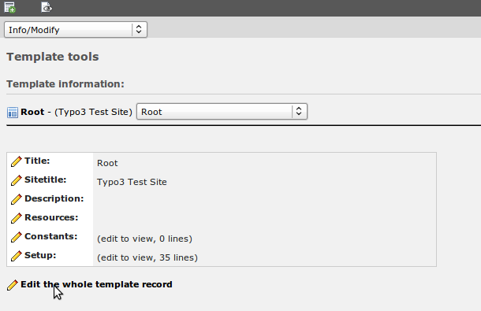
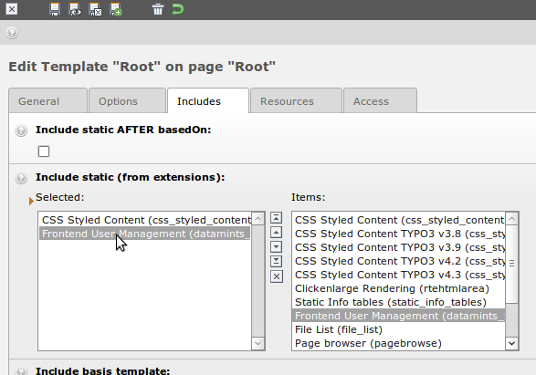
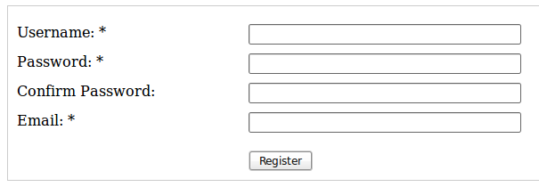

.. ==================================================
.. FOR YOUR INFORMATION
.. --------------------------------------------------
.. -*- coding: utf-8 -*- with BOM.

.. include:: ../../Includes.txt

.. _administration-quickstart:

Quickstart
----------

Here is a small quick start guide to create a full functional registration form in just 5 minutes.

First of all you have to add the extension's static template. Click on the "Template" module, than
select the site where your root template is located, select the root template, and click "Edit the
whole template record".

Then click the "Includes" tab and add the static template "Frontend User Management
(datamints_feuser)".

Save and close the root template. Click on the "Page" module and select the site where you want to
have the registration form. Add a new content element and then select the plugin "Frontend User
Management". Now go to the "Plugin" tab and add some "Database Fields" you want to display, in the
example I have selected username, password and email. Set the required (the user have to enter a
value) or unique (only one user can have this username, email, …) fields. You do not have to add
labels if you want to use the default TYPO3 labels.

.. image:: ../../Images/screenshot-plugin-configuration.png

Save it and check it out in the Frontend. It will probably look like this.

Now you have a full functional register form and other people can register themselves on your
website.

If the second password field is not displayed have a look at the FAQ.
